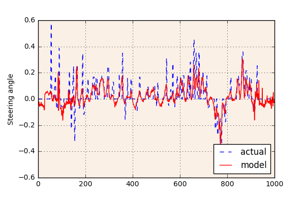

# Self-driving car: behavioural cloning

This code implements a neural network model to control a simulation of a car driving around a track.  The main files required are:

 - `model.py` - defines the model architecture in [Keras](https://keras.io/) and trains it against the [Udacity data set](https://d17h27t6h515a5.cloudfront.net/topher/2016/December/584f6edd_data/data.zip);
 - `model.json` - JSON file containing the model architecture;
 - `model.h5` - weights of the trained neural network; and
 - `drive.py` - uses the trained model to control the car simulation in real-time.

## Design approach
The training set contains images and steering angles saved while a human driver controls the car simulation as it moves around the track.  My starting point was to split the data-set into training and validation sets, and then implement a simple neural network in Keras comprising 1 convolutional layer followed by 1 fully connected layer to predict the steering angle of the car from the images taken by the centre camera.  As expected this model under-fit the data and was unable to control the car successfully, so I then implemented additional pre-processing steps and increased the model complexity in order to reduce the mean-squared error on the validation data.  Eventually this resulted in a model able to drive successfully around the test track.

### Pre-processing steps

#### Image size
All the images are re-sized to 80x40 pixels, which reduced the network size and training time without significantly compromising performance.

#### Colour space
Initial tests resulted in a model that seemed to focus on identifying the edge of the track, and therefore struggled in places where this is poorly defined, for example at the corner immediately after the bridge.  The plots below show a sample training image as separate RGB colour channels, and also after transformation to HSV colour space.  The road surface appears more well-defined in the H and S colour channels, so I used these as inputs to the neural network to encourage it to identify the road surface rather than the track edges.

#### Camera angles
The initial model also struggled to recover if the car veered off to the side of the track.  To remedy this I trained the network on training images taken from cameras angled to the left and right on the car, and offset the steering angle associated with these images to encourage the car to move back towards the centre of the track.  The final model was trained with:

 - Centre camera images with associated steering angles;
 - Left camera images with steering angles offset 0.3 to the right; and
 - Right camera images with steering angles offset 0.3 to the left.

#### Normalisation
The pixel data is normalised to the range [-0.5, +0.5] to aid performance of the optimiser during training.

#### Additional steps considered
I also trialled the following steps to discourage over-fitting, but ultimately did not see sufficient benefit to include them in the final model:

 - Transforming 50% of the training images by taking a mirror image, and changing the sign of the steering angle accordingly to increase the ability of the model to generalise to left and right turns; and
 - Adjusting the brightness of the training images at random - this might provide a benefit if the model were required to drive on different tracks under different brightness conditions.

### Model architecture

The final model architecture is similar to an image classification network, except the final layer has linear activation in order to provide a continuous-valued output for the steering angle.  The diagram below shows the complete architecture, which includes:

 - Initial convolution and pooling layers to squeeze the spatial dimensions of the input images;
 - 2 dropout layers which set 20% of the activations to zero in order to discourage over-fitting;
 - 4 fully connected layers; and
 - Relu activations after each layer to introduce non-linearity, and a linear activation at the final output layer to predict the steering angle.

### Training

Running `model.py` will train the model using an Adam optimiser with learning rate lowered to 0.0002.  A python generator loads the training data in batches of 128 images from one of the three camera angles, allowing training to be done without the need to load the entire data set into memory.  After 20 epochs across the training data the model achieved mean-squared error of 0.0088 against the validation set.

The plot below shows the actual and predicted steering angles for the first 1000 centre camera images in the training data - plots like this provided a useful aid when tuning the model architecture and hyper-parameters, for instance by highlighting where the network was under-fitting the actual steering angles.

## Simulation

Running `drive.py` will load the model architecture and weights from `model.json` and `model.h5` respectively, connect to the car simulation and control the vehicle around the track.  The throttle is calculated to reduce with increasing steering angle, allowing the car to slow down into corners.

The trained model can successfully navigate the test track without driving off the sides.

